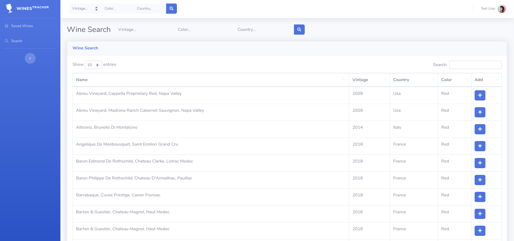
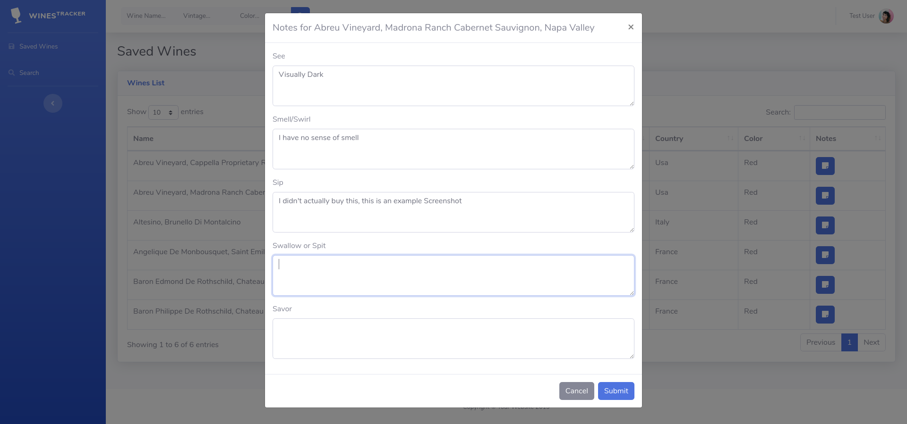

# Wines Tracker
**Devin Matte**

My main idea is that I wanted to take something that is a part of my major, as well as my passion, and combine it with the subject of wines.
The idea is a wine tracker. To keep track of the wines you've tried and your opinions of them.

The site is available at [https://wine-tracker.cs.house/](https://wine-tracker.cs.house/) and you will be automatically logged in as "Test User"

The code is all available at [https://github.com/devinmatte/wine-tracker](https://github.com/devinmatte/wine-tracker) as well as "Commits" which show's you a history of the development over time.

## Research

For my project I focused the majority of my research on finding a way to collect data about wines online.
I would an API (Application Programmable Interface) which allowed for the to collect data on a large list of wines.
The API was available at [https://www.globalwinescore.com/account/api/](https://www.globalwinescore.com/account/api/) and [https://globalwinescore.docs.apiary.io/](https://globalwinescore.docs.apiary.io/).
The API allowed me to search based on vintage, location and color, along with looking up more details once I had an `id` of a wine.
The API did ask me to reach out and request access, so after waiting 2 weeks I finally gained access and was able to use it.
Sadly the API didn't allow for to search based on the name of the wine, so I improvised with what I had.

## Design

I wanted to design an application that was visually appealing. I took what I had learned on my various co-ops and the content currently being covered in my User Interface Class to make the UI design you see.

You can search for wine through this page, and then filter the results inside the table further to find what you're looking for.
After that you can save any wine you like.
Once saved you can go to the `Saved Wines` page to see and add notes to your wines

You can update notes anytime you want, and submitting saves to the database.

## Time and Effort

I built this over the course of 2 weeks using the [python programming language](https://www.python.org/), a web framework called [flask](https://www.palletsprojects.com/p/flask/) and [bootstrap](https://getbootstrap.com/).
I wanted to build it to be easily usable, and did my best given the online databases available for wines.
I didn't want manual entry, so the limited search functionality was the best I could do without paying money.

## Resources

- https://www.globalwinescore.com/account/api/
- https://globalwinescore.docs.apiary.io/
- https://www.python.org/
- https://www.palletsprojects.com/p/flask/
- https://getbootstrap.com/
